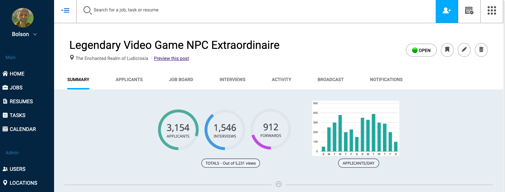
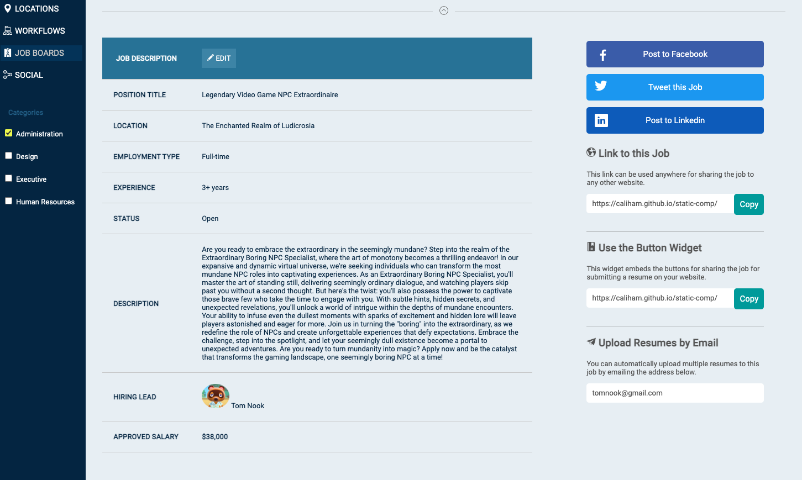

# Static-Comp

# Description
This project was to work on our CSS and HTML skills to build something that respects the integrity of the original design, image pasted below. I worked on this project over 5 days. I have sourced all of the icons through flaticons.com. Please note this is a static page and none of the buttons will work. Visit the page [here](https://caliham.github.io/static-comp/).

# Original Design

# My Version

# Final Notes
Overall, I am very proud of this page! It was fun and challenging and I have learned a lot obout both CSS and HTML. I wish I had more time to research and complete the graphic without using another source to make the graphs. I also could not figure out the checkbox's background colors, so I could only get them to change when clicked. I will definitely continue to work on these skills to utilize them for future projects.